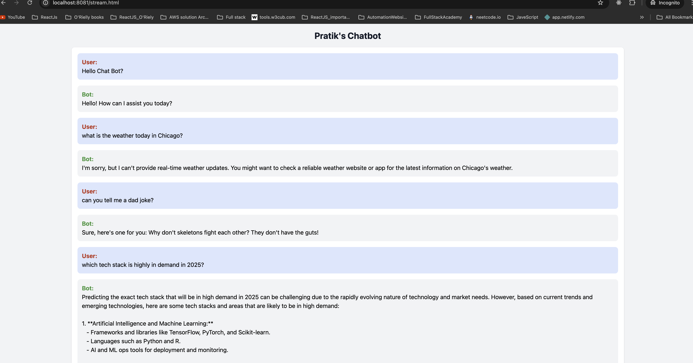

# OpenAI_and-_SpringBoot

  - Its Simple Spingboot OpenAI text search using limited token response


# Spring AI Chat Bot with Streaming Support

Welcome to the **Spring AI Chat Bot** project! This application demonstrates how to create a chatbot with **streaming capabilities** using Spring AI and Spring Boot. By leveraging the power of **Spring AI**, this project delivers a robust and scalable solution for real-time AI-powered conversations.

---

## 📖 Project Overview

This project integrates **Spring AI** with **Spring Boot** to create a chatbot that supports:
- Traditional request-response interactions.
- Streaming responses for real-time AI chat functionality.

It's an excellent starting point for developers who want to add **AI-powered chat capabilities** to their Spring applications.

---

## 🛠️ Project Requirements

To build and run the project, ensure you have the following:

- **Java 21**  
- **Maven 3.6.3** or newer  
- **Spring Boot 3.3.4**  
- **Spring AI 1.0.0-M2**

---

## 📦 Key Dependencies

The project uses the following dependencies:

1. **`spring-boot-starter-web`**  
   For building web applications with Spring MVC.

2. **`spring-ai-anthropic-spring-boot-starter`**  
   Spring AI starter for Anthropic's AI models.

3. **`spring-boot-starter-test`**  
   For testing Spring Boot applications.

---

## 🚀 Features

- **AI-Powered Chatbot**: Supports request-response and streaming chat interactions.
- **Spring Boot Integration**: Utilizes the robust Spring Boot framework for backend development.
- **Scalability**: Designed for real-time, scalable AI chat experiences.

---

## 📂 Project Structure

- **`ChatController.java`**: Handles incoming HTTP requests for chat interactions.
- **`ChatService.java`**: Core business logic for integrating with Spring AI.
- **`AppConfig.java`**: Configuration for Spring beans and services.
- **`application.properties`**: Configuration file for Spring Boot settings.

---

## 🔧 Getting Started

### 1. Clone the Repository
```bash
git clone https://github.com/PatelPratik39/OpenAI_and_SpringBoot
cd spring-ai-chat-bot


